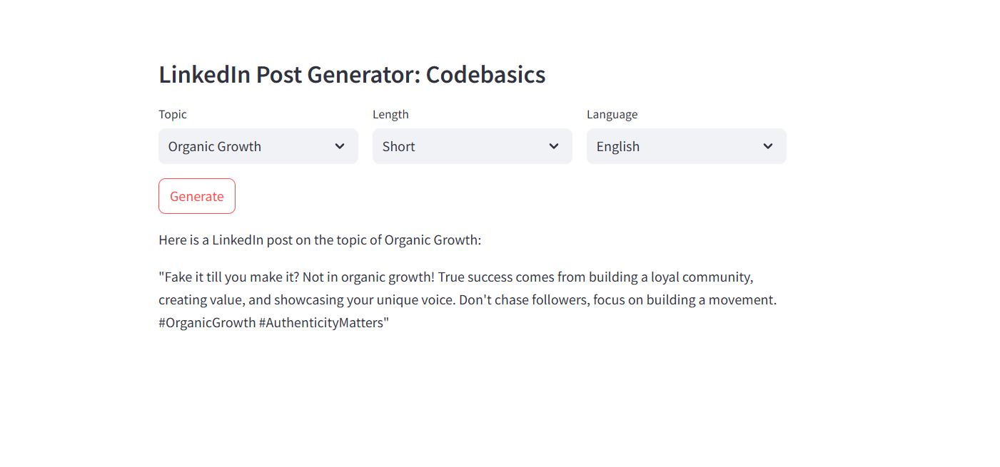

# 🧠 GenAI LinkedIn Post Generator

A powerful AI tool that helps LinkedIn influencers create new posts in their **own writing style** using past content. Built with **Streamlit**, **LangChain**, and **Groq**.

---

## 🚀 Overview

This tool analyzes your existing LinkedIn posts to learn your writing style. Based on your selected **topic**, **language**, and **post length**, it generates personalized posts using **LLMs hosted on Groq**.

---

## ✨ Features

- 🔍 Analyze your own past LinkedIn content
- ✨ Few-shot prompting to guide the LLM with your writing style
- 📝 Select post topic, language, and length
- ⚡ Fast and responsive — powered by Groq’s low-latency inference
- 🧠 Uses top open models like LLaMA 3 and Mixtral via LangChain

---

## 🛠️ How It Works

1. **Upload Past Posts** → Extracts metadata: topic, language, length
2. **Select Parameters** → Choose topic, post length, language
3. **Generate Post** → Uses selected inputs and few-shot examples to generate new posts using an LLM

---

## 🧪 Tech Stack

- 💬 LangChain
- 🚀 Groq (LLMs like `llama3-8b-8192`, `mixtral-8x7b-32768`)
- 🌐 Streamlit
- 🧾 Pandas
- 🗝️ `.env` for API key management

---
